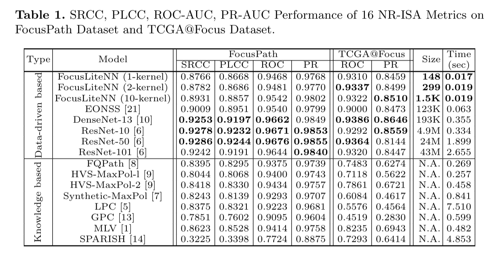

## FocusLiteNN

This is the official **PyTorch** and **MATLAB** implementations of our MICCAI 2020 paper [*"FocusLiteNN: High Efficiency Focus Quality Assessment for Digital Pathology"*](TODO).


### 0. Table of Contents
- [FocusLiteNN](#focuslitenn)
  - [0. Table of Contents](#0-table-of-contents)
  - [1. Brief Introduction](#1-brief-introduction)
    - [1.1 Backgrounds](#11-backgrounds)
    - [1.2 Contributions](#12-contributions)
    - [1.3 Results](#13-results)
    - [1.4 Citation](#14-citation)
  - [2. Dataset](#2-dataset)
    - [2.1 TCGA@Focus](#21-tcgafocus)
    - [2.2 Focuspath Full](#22-focuspath-full)
  - [3. Prerequest](#3-prerequest)
    - [3.1 Environment](#31-environment)
    - [3.2 Packages](#32-packages)
    - [3.3 Pretrained Models](#33-pretrained-models)
  - [4. Running the code](#4-running-the-code)
    - [4.1 Python Demo for testing a single image (heatmap available)](#41-python-demo-for-testing-a-single-image-heatmap-available)
    - [4.2 MATLAB Demo for testing a single image (non-efficient implementation)](#42-matlab-demo-for-testing-a-single-image-non-efficient-implementation)
    - [4.3 Training FocusLiteNN on Focuspath_full](#43-training-focuslitenn-on-focuspath_full)
    - [4.4 Testing FocusLiteNN on TCGA@Focus](#44-testing-focuslitenn-on-tcgafocus)
  - [5. License](#5-license)

### 1. Brief Introduction

#### 1.1 Backgrounds

- **Out-of-focus microscopy lens** in digital pathology is a **critical bottleneck** in high-throughput Whole Slide Image scanning platforms, for which Focus Quality Assessment methods are highly desirable to help significantly accelerate the clinical workflows.
- While **data-driven approaches** such as Convolutional Neural Network based methods have shown great promises, they are difficult to use in practice due to their **high computational complexity**.

#### 1.2 Contributions

- We propose a **highly efficient** CNN-based model FocusLiteNN that only has **148 paramters** for Focus Quality Assessment. It maintains impressive performance and is **100x faster** than ResNet50.
- We introduce a **comprehensive annotated dataset** [TCGA@Focus](https://zenodo.org/record/3910757#.Xve1MXX0kUe), which contains 14371 pathological images with in/out focus labels.

#### 1.3 Results

- Evaluation results on the proposed [TCGA@Focus](https://zenodo.org/record/3910757#.Xve1MXX0kUe) dataset
  

- Our proposed FocusLiteNN (1-kernel) model is highly efficient.
  

#### 1.4 Citation

Please cite our paper if you find our model or the [TCGA@Focus](https://zenodo.org/record/3910757#.Xve1MXX0kUe) dataset useful.
```
@InProceedings{wang2020focuslitenn,
    title={FocusLiteNN: High Efficiency Focus Quality Assessment for Digital Pathology},
    author={Wang, Zhongling and Hosseini, Mahdi and Miles, Adyn and Plataniotis, Konstantinos and Wang, Zhou},
    booktitle={Medical Image Computing and Computer Assisted Intervention -- MICCAI 2020},
    year={2020},
    publisher="Springer International Publishing"
}
```

### 2. Dataset

#### 2.1 [TCGA@Focus](https://zenodo.org/record/3910757#.Xve1MXX0kUe)

  - **Download**: The dataset is available on Zenodo under a Creative Commons Attribution license: [](https://doi.org/10.5281/zenodo.3910757).
  - **Content**: Contains **14371** pathological images with in/out focus labels.
  - **Testing**: This is the **testing** dataset proposed and used in the paper. The specific testing images (14371 images) can be found in [`data/TCGA@Focus.txt`](data/TCGA@Focus.txt)

#### 2.2 [Focuspath Full](https://zenodo.org/record/3926181#.Xv4vg3X0kUd)

   - **Download**: The dataset is available on Zenodo under a Creative Commons Attribution license: [](https://doi.org/10.5281/zenodo.3926181)

   - **Content**:Contains **8640** pathological images of different blur levels.
   - **Training**: This is the **training** dataset used in the paper. The specific training images (5200 images) in one of the ten folds can be found in [`data/FocusPath_full_split1.txt`](data/FocusPath_full_split1.txt)

### 3. Prerequest

#### 3.1 Environment

The code has been tested on `Ubuntu 18.04` with `Python 3.8` and `cuda 10.2`

#### 3.2 Packages

`pytorch=1.4`, `torchvision=0.5`, `scipy`, `pandas`, `pillow` (or `pillow-simd`)

#### 3.3 Pretrained Models

  - Pretrained models could be found in folder `pretrained_model/`
  - Pretrained models for ResNet10, ResNet50 and ResNet101 are available for download at [Download Link](https://drive.google.com/drive/folders/1TuvR7iHzatriHNndClMxMwiKRmxOShWr?usp=sharing). The downloaded models should be put under `pretrained_model/`

### 4. Running the code

- Available architectures:
  - FocusLiteNN (1kernel, `--arch FocusLiteNN --num_channel 1`)
  - FocusLiteNN (2kernel, `--arch FocusLiteNN --num_channel 2`)
  - FocusLiteNN (10kernel, `--arch FocusLiteNN --num_channel 10`)
  - [EONSS](https://github.com/icbcbicc/EONSS-demo) (`--arch eonss`)
  - [DenseNet13](https://github.com/pytorch/vision/blob/master/torchvision/models/densenet.py) (`--arch densenet13`)
  - [ResNet10](https://github.com/pytorch/vision/blob/master/torchvision/models/resnet.py) (`--arch resnet10`)
  - [ResNet50](https://github.com/pytorch/vision/blob/master/torchvision/models/resnet.py) (`--arch resnet50`)
  - [ResNet101](https://github.com/pytorch/vision/blob/master/torchvision/models/resnet.py) (`--arch resnet101`)
- You may need to adjust `--batch_size` and `--num_workers` according to your machine configuration.
- This section only shows basic usages, please refer to the code for more options.


#### 4.1 Python Demo for testing a single image (heatmap available)

`python demo.py --arch FocusLiteNN --num_channel 1 --img imgs/TCGA@Focus_patch_i_9651_j_81514.png`

The score should be -1.548026 for `imgs/TCGA@Focus_patch_i_9651_j_81514.png`

The score should be -1.548026 for `imgs/TCGA@Focus_patch_i_9651_j_81514.png`

#### 4.2 MATLAB Demo for testing a single image (non-efficient implementation)

run `matlab/FocusLiteNN-1kernel.m`

#### 4.3 Training FocusLiteNN on [Focuspath_full](https://zenodo.org/record/3926181#.Xv4vg3X0kUd)

1.  Download and extract the Focuspath Full dataset under `data/`
2.  Basic usage: `python train_model.py --use_cuda True --arch FocusLiteNN --num_channel 1 --trainset "data/FocusPath Full/FocusPath_full" --train_csv data/FocusPath_full_split1.txt`

#### 4.4 Testing FocusLiteNN on [TCGA@Focus](https://zenodo.org/record/3910757#.Xve1MXX0kUe)

1.  Download and extract the TCGA@Focus dataset under `data/`
2.  Basic usage: `python test_model.py --use_cuda True --arch FocusLiteNN --num_channel 1 --ckpt_path pretrained_model/focuslitenn-1kernel.pt --testset "data/TCGA@Focus/Image Patches Database" --test_csv data/TCGA@Focus.txt`

### 5. License

FocusLiteNN is released under [The Prosperity Public License 3.0.0](LICENSE).